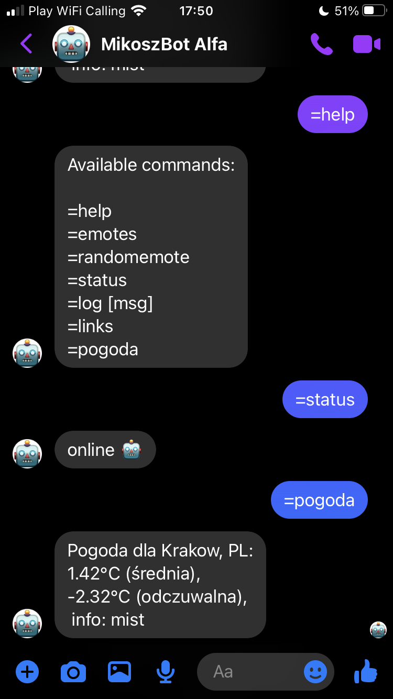
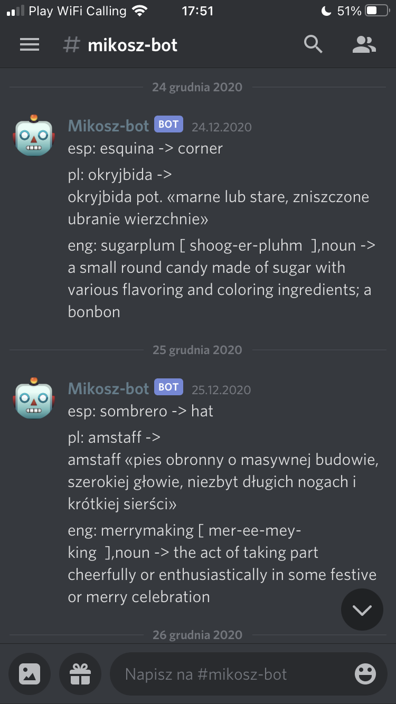
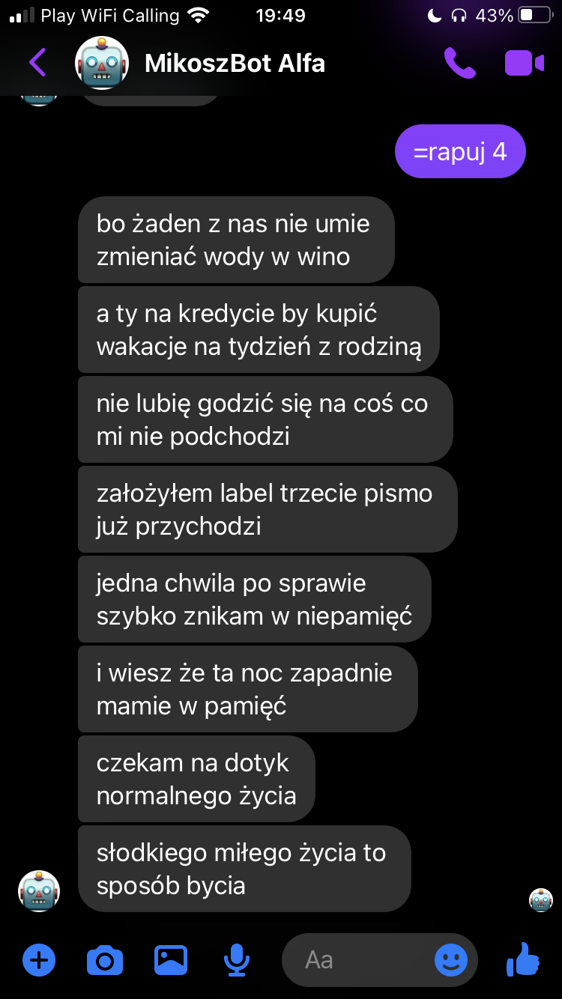

# mikosz-bot
Simple bot with [word-of-the-day](https://github.com/thezapalsky/word-of-the-day) functionality, custom facebook emotes and bunch of other stuff.

## sample usage:

Facebook Messenger            |  Discord
:-------------------------:|:-------------------------:
  |  

## to do:
- macOS context menu with Rumps
- **code refactoring** (pls don't look there yet, it's a mess 😐)

## new features:
- admin commands added
- fixed some bugs
- the bot can [rhyme](https://youtu.be/krrl1bP-b4U) in polish now, if you're curious how he does it - [DM](https://thezapalsky.github.io/) me.
